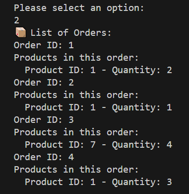

# REST API in Express.js

## Features

- **View Products**: See a list of available products with their details.
- **View Orders**: See a list of orders, including product IDs and quantities.
- **Add a Product**: Add new products to the inventory with a name, price, and stock.
- **Create an Order**: Create an order by selecting products and specifying quantities.


## Screenshots

### Main menu


### View Products


### View Orders


### Add a Product


### Create an Order


### Exit


## Requirements

- **Dart SDK**: This project is written in Dart, and you’ll need the Dart SDK installed to run the application.
- **Express.js API Server**: The project uses an Express.js server to handle product and order management.
- **API URL**: The server must be running on `http://localhost:3000` for the client to interact with the data.

## Running the Project

1. **Start the Server**: Ensure the API server is running. You can run the server from the `backend` directory:
```bash
 node server.js
```

2. **Run the Client** : In the api-client directory, run the client using Dart:
```bash
 dart run main.dart
```
## Notes
The API server uses a local data.json file to store product and order data.

The client is a simple terminal-based interface for interacting with the server.
