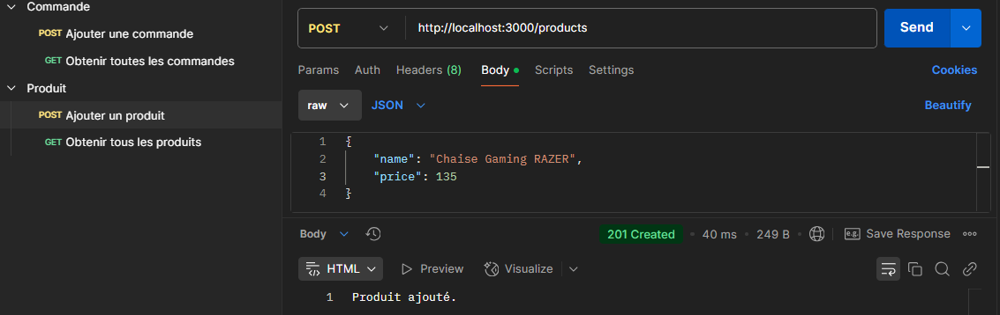

# 1. Création de l'API REST (Express.js)

## 1.1 Implémentation de la route GET pour récupérer tous les produits

### Commande dans le fichier `server.js`

```js
app.get('/products', (req, res) => {
  const data = loadData();
  res.json(data.products);
});
```
**Explication :** 
Cette route renvoie tous les produits enregistrés dans le fichier data.json. Elle utilise la fonction `loadData()` pour charger les produits et les envoyer dans la réponse sous forme de JSON.

## 1.2 Implémentation de la route POST pour ajouter un nouveau produit

### Commande dans le fichier `server.js` :


```js
app.post('/products', (req, res) => {
  const data = loadData();
  const newProduct = req.body;
  data.products.push(newProduct);
  saveData(data);
  res.status(201).send('Produit ajouté');
});
```

**Explication :** 
Cette route permet d'ajouter un nouveau produit à la liste. Le produit est envoyé dans le corps de la requête, puis ajouté au fichier data.json.

## 1.3 Implémentation de la route GET pour récupérer toutes les commandes
### Commande dans le fichier `server.js` :

```js
app.get('/orders', (req, res) => {
  const data = loadData();
  res.json(data.orders);
});
```

**Explication :** 
Cette route renvoie toutes les commandes enregistrées dans data.json, en utilisant la fonction `loadData()` pour récupérer les données.

## 1.4 Implémentation de la route POST pour créer une nouvelle commande
### Commande dans le fichier `server.js` :

```js
app.post('/orders', (req, res) => {
  const data = loadData();
  const newOrder = req.body;
  data.orders.push(newOrder);
  saveData(data);
  res.status(201).send('Commande créée');
});
```

**Explication :** 
Cette route permet de créer une nouvelle commande en envoyant les informations du produit et de la quantité dans le corps de la requête. Les données sont ensuite sauvegardées dans le fichier `data.json`

# 2. Développement du Client Dart
## 2.1 Récupérer et afficher les produits via une requête GET
### Code Dart :

```dart
Future<void> getProducts(String baseUrl) async {
  final response = await http.get(Uri.parse('$baseUrl/products'));

  if (response.statusCode == 200) {
    List<dynamic> products = jsonDecode(response.body);
    for (var product in products) {
      print('Nom: ${product['name']}, Prix: ${product['price']}');
    }
  } else {
    print('Erreur lors de la récupération des produits');
  }
}
```
### Capture d'écran de l'appel GET dans Postman :


**Explication :**  
Cette fonction Dart envoie une requête GET pour récupérer la liste des produits depuis l'API Express. Elle décode la réponse JSON et affiche les produits.

## 2.2 Ajouter un produit via une requête POST
### Code Dart :

```dart
Future<void> addProduct(String baseUrl, Map<String, dynamic> product) async {
  final response = await http.post(
    Uri.parse('$baseUrl/products'),
    headers: {HttpHeaders.contentTypeHeader: 'application/json'},
    body: jsonEncode(product),
  );

  if (response.statusCode == 201) {
    print('Produit ajouté.');
  } else {
    print('Erreur lors de l\'ajout du produit');
  }
}
```
### Capture d'écran de l'appel POST dans Postman :



**Explication :** 
Cette fonction Dart envoie une requête POST pour ajouter un produit à l'API. Le produit est envoyé dans le corps de la requête sous forme de JSON.

## 2.3 Récupérer et afficher les commandes via une requête GET
### Code Dart :

```dart
Future<void> getOrders(String baseUrl) async {
  final response = await http.get(Uri.parse('$baseUrl/orders'));

  if (response.statusCode == 200) {
    List<dynamic> orders = jsonDecode(response.body);
    for (var order in orders) {
      print('Produit: ${order['product']}, Quantité: ${order['quantity']}');
    }
  } else {
    print('Erreur lors de la récupération des commandes');
  }
}
```
### Capture d'écran de l'appel GET des commandes dans Postman :


**Explication :** 
Cette fonction Dart envoie une requête GET pour récupérer la liste des commandes depuis l'API Express et les affiche.

## 2.4 Ajouter une commande via une requête POST
### Code Dart :

```dart
Future<void> addOrder(String baseUrl, Map<String, dynamic> order) async {
  final response = await http.post(
    Uri.parse('$baseUrl/orders'),
    headers: {HttpHeaders.contentTypeHeader: 'application/json'},
    body: jsonEncode(order),
  );

  if (response.statusCode == 201) {
    print('Commande créée.');
  } else {
    print('Erreur lors de la création de la commande');
  }
}
```
### Capture d'écran de l'appel POST dans Postman :


**Explication :** 
Cette fonction Dart permet d'envoyer une requête POST pour créer une nouvelle commande en utilisant les informations du produit et de la quantité dans le corps de la requête.

# Conclusion
Ce fichier fournit une vue d'ensemble des étapes clés pour implémenter l'**API REST** avec **Node.js** et le client **Dart**. Les captures d'écran et explications sont organisées de manière à suivre l'ordre des consignes du TP.