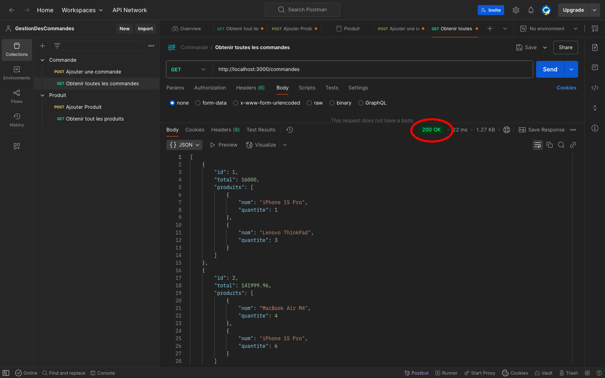
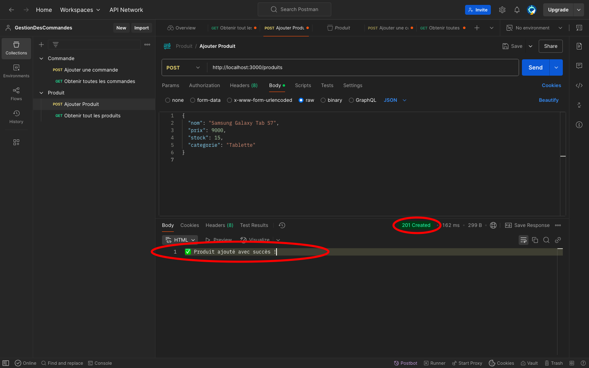
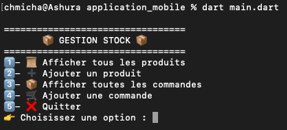
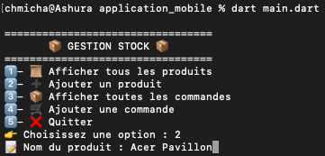
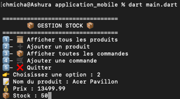
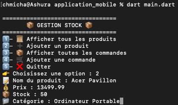
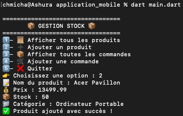

# 📦 Gestion de Stock - API REST + Client Dart

Ce projet implémente une **API REST** en **Express.js** permettant de gérer des produits et des commandes, et un **client Dart** qui interagit avec cette API pour récupérer et ajouter des produits et des commandes.

---

## 🎯 Objectifs du Projet

L'objectif de ce projet est de créer une solution permettant :

1. **Backend (API REST en Express.js)** :
   - Gérer les produits (ajout et récupération).
   - Gérer les commandes (ajout et récupération).

2. **Frontend (Client Dart)** :
   - Afficher la liste des produits et des commandes récupérées depuis l'API.
   - Permettre l'ajout de nouveaux produits et commandes.

  ---

## 🗂 Structure du Projet

Voici la structure des dossiers et fichiers :
```
/gestion-stock-app/
├── application_mobile/               # Application Flutter mobile
│   ├── main.dart                     # Point d'entrée de l'application mobile, gère l'UI et la logique d'interaction avec l'API.
│   ├── pubspec.yaml                  # Fichier de configuration pour Flutter, incluant les dépendances et les configurations du projet mobile.
│   └── pubspec.lock                  # Fichier généré par Flutter pour verrouiller les versions des dépendances.
│ 
├── client_api/                       # Client API Flutter pour interagir avec l'API serveur
│   ├── client_api.dart               # Contient des méthodes statiques pour interagir avec l'API (ajouter des produits/commandes, récupérer la liste des produits/commandes).
│   ├── pubspec.yaml                  # Configuration pour les dépendances du client API Flutter.
│   └── pubspec.lock                  # Fichier généré pour verrouiller les versions des dépendances.
│ 
├── serveur_api/                      # Backend qui gère l'API
│   ├── db.json                       # Fichier JSON contenant les données persistantes des produits et commandes.
│   ├── package-lock.json             # Fichier de verrouillage des dépendances pour le backend Node.js.
│   ├── package.json                  # Définition des dépendances et scripts pour le serveur API.
│   └── server.js                     # Code du serveur backend en Node.js pour gérer les requêtes HTTP (GET, POST) liées aux produits et commandes.
│
├── screenshots/                      # Contient des captures d'écran du projet en action
│   ├── S1.png                        # Screenshot de la première étape de l'ajout de produits
│   ├── S2.png                        # Screenshot de la deuxième étape de l'ajout de produits
│   ├── S3.png                        # Screenshot de la troisième étape de l'ajout de produits
│   ├── S4.png                        # Screenshot de la quatrième étape de l'ajout de produits
│   ├── S5.png                        # Screenshot de la cinquième étape de l'ajout de produits
│   ├── S6.png                        # Screenshot de la sixième étape de l'ajout de produits
│   ├── GET_COMMANDES.png             # Screenshot de la requête GET /commandes dans Postman
│   └── POST_PRODUITS.png             # Screenshot de la requête POST /produits dans Postman
│ 
├── README.md                         # Documentation du projet.
└── .gitignore                        # Liste des fichiers et répertoires à ignorer par Git.
```
---


## ⚙️ Fonctionnalités

### API REST (Express.js)
L'API fournit les fonctionnalités suivantes :

- **GET /produits 🛍️** : Récupère la liste de tous les produits disponibles.
- **POST /produits ➕** : Permet d'ajouter un nouveau produit.
- **GET /commandes 📦** : Récupère la liste de toutes les commandes.
- **POST /commandes 📝** : Permet de créer une nouvelle commande.

Les données sont stockées dans un fichier `db.json` et chaque modification est immédiatement sauvegardée.

### Client Dart (Frontend)
Le client Dart offre les fonctionnalités suivantes :

- **Afficher les produits 🛍️** : Effectuer une requête GET pour récupérer et afficher les produits.
- **Ajouter un produit ➕** : Utiliser une requête POST pour ajouter un produit à la liste.
- **Afficher les commandes 📦** : Effectuer une requête GET pour récupérer et afficher les commandes.
- **Ajouter une commande 📝** : Utiliser une requête POST pour ajouter une commande.
---

## 📋 Prérequis

Avant de commencer, assurez-vous d'avoir installé les outils suivants :

- [Node.js](https://nodejs.org/en/) pour le serveur backend.
- [Dart SDK](https://dart.dev/get-dart) pour le client Dart.

---

## 🔧 Installation

### 1. Cloner le dépôt

- Clonez le projet depuis GitHub :

```bash
git clone https://github.com/chmichaaa/stock-management-api-dart.git
cd gestion-stock-dart
```

### 2. Installer les dépendances
#### Backend - API REST (Express.js)

- Accédez au dossier du serveur API :

```bash
cd serveur_api
```

- Installez les dépendances avec npm :

```bash
npm install
```

- Démarrer le serveur

```bash
node server.js
```

Le serveur sera accessible à l'URL suivante : `http://localhost:3000.`

#### Frontend - Client Dart

- Accédez au dossier de l'application Flutter :

```bash
cd ../application_mobile
```

- Installez les dépendances Dart :

```bash
dart pub get
```

- Lancer l'application


```bash
dart run main.dart
```

Cela démarrera l'application Dart et elle sera accessible sur votre appareil ou émulateur.

---

## 🔧 Fonctionnement de l'API

### 1. Route GET /produits 🛍️
   
Récupère tous les produits stockés dans `db.json` :
```js
// Route GET pour récupérer tous les produits
app.get("/produits", (req, res) => {
    const data = lireDonnees();
    res.json(data.produits);
});
```
### 2. Route POST /produits ➕

Ajoute un nouveau produit :

```js
// Route POST pour ajouter un produit
app.post("/produits", (req, res) => {
    const data = lireDonnees();
    const nouveauProduit = req.body;
    data.produits.push(nouveauProduit);
    sauvegarderDonnees(data);
    res.status(201).send("✅ Produit ajouté avec succès !");
});
```

### 3. Route GET /commandes 📦

Récupère toutes les commandes :

```js
// Route GET pour récupérer toutes les commandes
app.get("/commandes", (req, res) => {
    const data = lireDonnees();
    res.json(data.commandes);
});
```

### 4. Route POST /commandes 📝

Crée une nouvelle commande :

```js
// Route POST pour créer une commande
app.post("/produits", (req, res) => {
    const data = lireDonnees();
    const nouveauProduit = req.body;
    data.produits.push(nouveauProduit);
    sauvegarderDonnees(data);
    res.status(201).send("✅ Commande ajoutée avec succès !");
});
```

---

## 🤖 Interaction avec l'API - Client Dart
### 1. Récupérer et afficher les produits
```dart
/// ✅ Récupérer et afficher tous les produits
Future<void> fetchProducts() async {
  final response = await _sendGetRequest("$apiUrl/produits");

  if (response != null) {
    List<dynamic> products = jsonDecode(response.body);
    if (products.isEmpty) {
      print("📦 Aucun produit disponible.");
    } else {
      print("\n📜 Liste des produits disponibles:");
      for (var product in products) {
        print(
            "🔹 ${product['nom']} (${product['categorie']}) - ${product['prix']} DH | Stock: ${product['stock']}");
      }
    }
  }
}
```
### 2. Ajouter une commande

```dart
/// ✅ Ajouter une commande
Future<void> addOrder() async {
  List<Map<String, dynamic>> produits = [];
  double total = 0.0;

  while (true) {
    stdout.write("🛒 Nom du produit (ou 'fin' pour terminer) : ");
    String? name = stdin.readLineSync();

    if (name == null || name.toLowerCase() == 'fin') break;

    stdout.write("📦 Quantité : ");
    int? quantity = int.tryParse(stdin.readLineSync() ?? "");

    if (quantity == null || quantity <= 0) {
      print("❌ Quantité invalide. Réessayez.");
      continue;
    }

    var product = await _getProductByName(name);
    if (product == null) {
      print("❌ Produit introuvable.");
      continue;
    }

    if (quantity > product['stock']) {
      print("❌ Stock insuffisant.");
      continue;
    }

    // Mise à jour du stock
    product['stock'] -= quantity;
    await _updateProductStock(product['id'], product['stock']);

    total += product['prix'] * quantity;
    produits.add({"nom": name, "quantite": quantity});
  }

  if (produits.isEmpty) {
    print("❌ Aucune commande enregistrée.");
    return;
  }

  int newOrderId = await _getNextOrderId();

  Map<String, dynamic> order = {
    "id": newOrderId,
    "produits": produits,
    "total": total,
  };

  final response = await _sendPostRequest("$apiUrl/commandes", order);
  if (response != null && response.statusCode == 201) {
    print("✅ Commande ajoutée avec succès !");
  } else {
    print("❌ Erreur lors de l'ajout de la commande.");
  }
}
```

---

## 📸 Captures d'écran
### - Test API avec Postman

#### Voici à quoi cela ressemble lors des tests dans Postman :

- Requête GET /commandes :

  



- Requête POST /produits :

  



### - Interface Client Dart

#### Voici un aperçu de l'interface du client Dart pour ajouter les produits :
### Écran 1


### Écran 2


### Écran 3


### Écran 4


### Écran 5


### Écran 6

